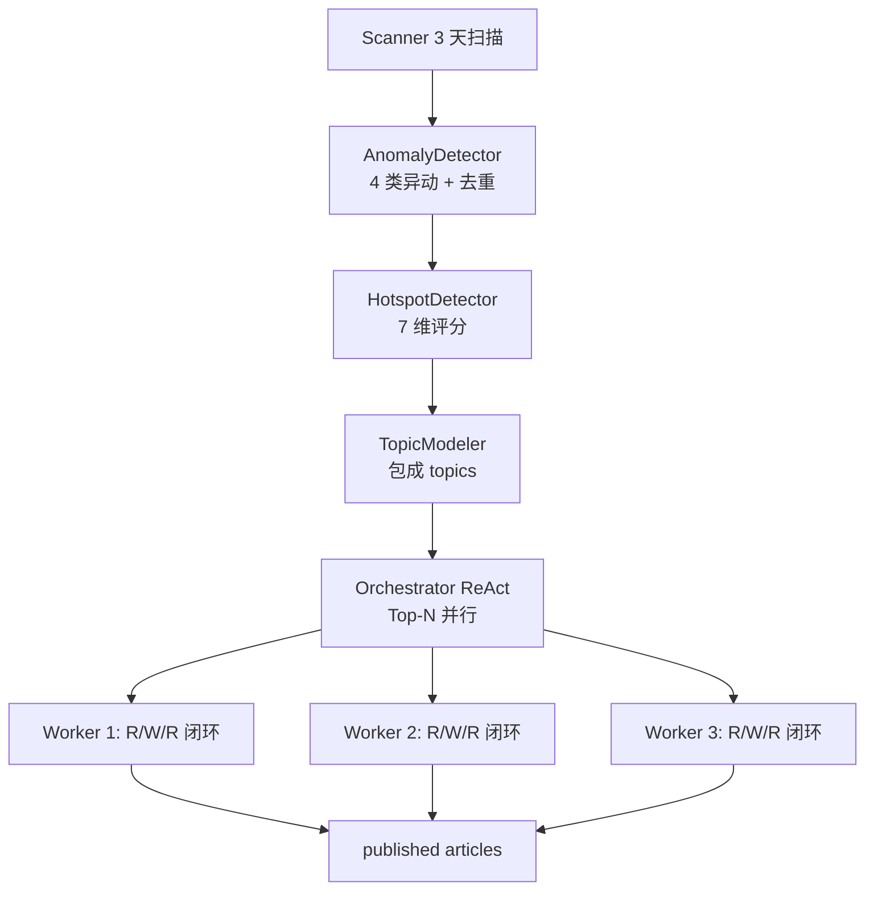
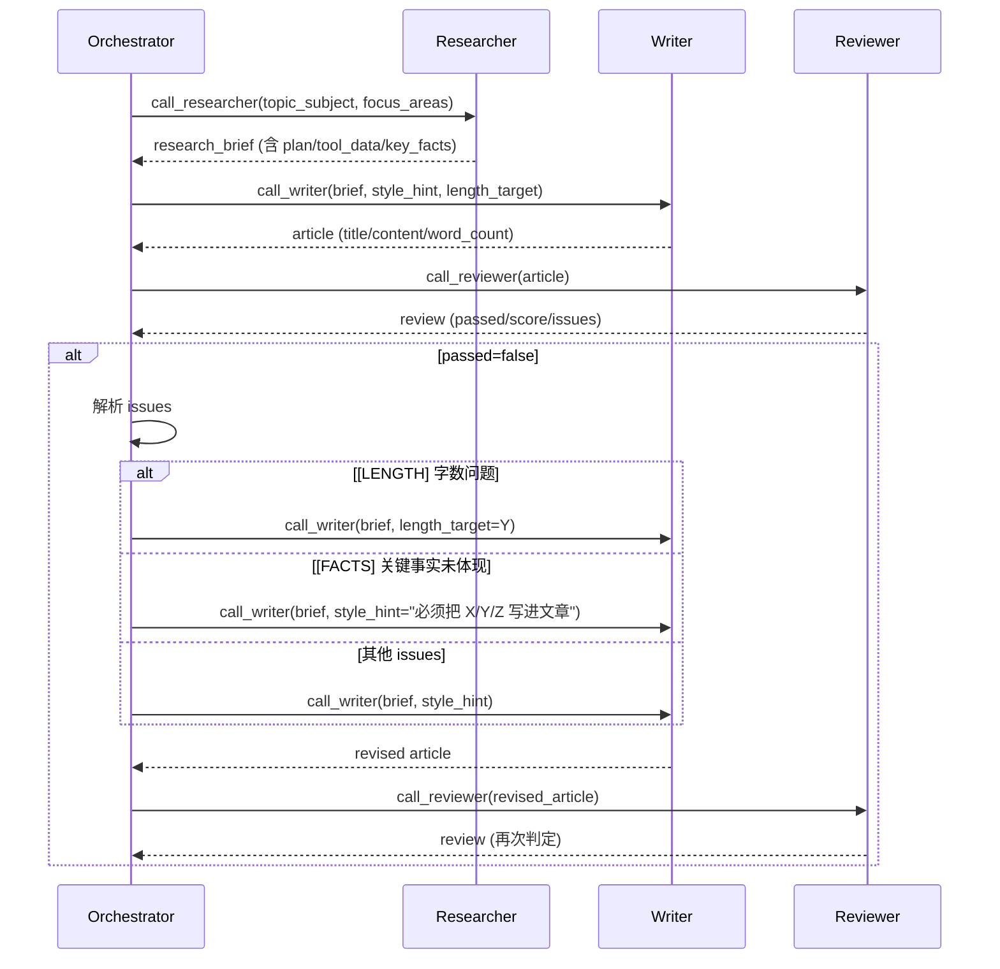
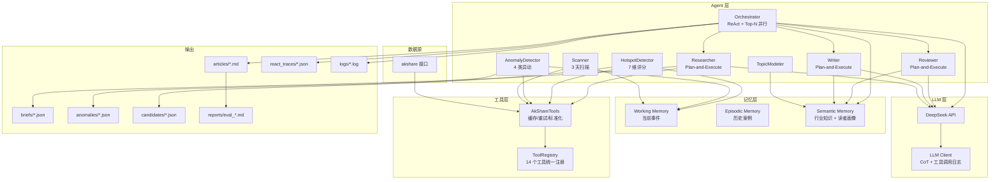
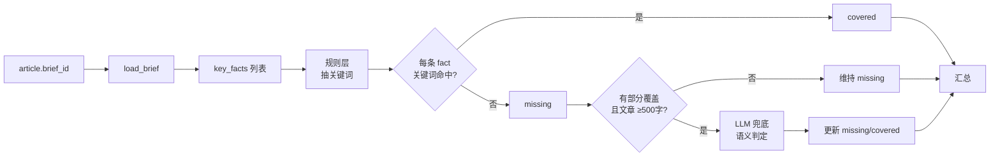

# 财经热点发现与内容生产 Multi-Agent 系统

> 基于 akshare + DeepSeek 的端到端热点发现 + 内容生产流水线  
> Orchestrator 用 ReAct 模式自主调度 3 个子 Agent（Researcher / Writer / Reviewer）  
> 每个子 Agent 内部用 Plan-and-Execute，支持并行 sub-agent  
> Top-N candidates 并行处理，从"扫一次出 1 篇"到"扫一次出 5 篇"

---

## 目录

- [系统目标](#系统目标)
- [核心设计](#核心设计)
- [系统架构](#系统架构)
- [项目结构](#项目结构)
- [安装与运行](#安装与运行)
- [运行模式](#运行模式)
- [关键参数调优](#关键参数调优)
- [输出产物](#输出产物)
- [工具与子 Agent](#工具与子-agent)
- [ReAct 闭环详解](#react-闭环详解)
- [Reviewer 四重门禁](#reviewer-四重门禁)
- [评估体系](#评估体系)
- [调试与排查](#调试与排查)
- [已知限制](#已知限制)
- [License](#license)

---

## 系统目标

把"被动跟随竞品标题"升级为**多源信号驱动 + 量化热点建模 + 多 Agent 协同 + 持续反馈迭代**的闭环系统。

**核心转变**：

| 维度 | 旧模式 | 新模式 |
|------|--------|--------|
| 信息源 | 单一竞品标题 | 7+ 源信号（涨停/异动/资金流/公告/快讯/研报/财务） |
| 触发 | 标题到达 | 异动检测 + 跨源共振（板块/资金/异动多维） |
| 价值判断 | 经验性 | 7 维特征向量 + 量化评分 |
| 上下文 | 每次独立 | 三层记忆（WM/EM/SM） |
| 编排 | 状态机串行 | Orchestrator ReAct 自主决策 |
| 内容生产 | 单篇 | Top-N 并行（默认 5 candidates × 3 workers） |
| 子 Agent 协作 | 显式串联 | ReAct + Plan-and-Execute，子 Agent 不直接通信 |
| 闭环 | 单次 review | review → writer 修复 → review（直到 passed） |

---

## 核心设计

### 1. 热点建模：7 维特征向量

$$\mathbf{H} = (I, P, V, N, R, D, L)$$

| 维度 | 含义 | 数据源 |
|------|------|--------|
| $I$ Intensity | 强度 | 异动类型 + 数量 |
| $P$ Persistence | 持续性 | 时间序列稳定性 |
| $V$ Virality | 传播性 | 跨异常类型 |
| $N$ Novelty | 新颖度 | 历史案例相似度 |
| $R$ Relevance | 主体关联性 | 行业知识图谱 |
| $D$ Value Density | 价值密度 | 信息含量 |
| $L$ Lead Time | 提前量 | 与竞品时差 |

**综合评分**：

$$\text{Score}(H) = w^T \mathbf{H}, \quad w = (0.20, 0.10, 0.10, 0.15, 0.15, 0.20, 0.10)$$

### 2. 异动检测：4 类跨源共振

- `board_resonance` —— 同板块多只个股涨停（去重后 ≥ 3 只不同个股）
- `board_change_with_fundflow` —— 板块异动 + 主力净流入
- `change_with_limitup` —— 板块异动频繁（≥ 5 次）+ 多只涨停（≥ 2 只）
- `risk_concentration` —— 同板块多只跌停（风险信号）

### 3. Orchestrator ReAct 模式

**不**用状态机硬编码调度，改成 LLM 自主决策：



每个 worker 内部 ReAct 流程：



### 4. 子 Agent Plan-and-Execute

每个子 Agent（Researcher / Writer / Reviewer）有**显式 plan 阶段**：

- **Researcher**：LLM 生成 5 步研究 plan → 按 plan 顺序执行 → 同 tool 连续调用拆成 batch 并行
- **Writer**：先 LLM 写写作策略（angle/data_points/must_include/tone）→ 单次 LLM 出全文
- **Reviewer**：LLM 生成 8-10 项 checklist → 按 checklist 逐项审 → 字数 / 关键事实 / LLM / 数据完整性 四重门禁

子 Agent 之间**不直接通信**，完全由 Orchestrator 决定调用顺序、传什么 prompt。

### 5. Reviewer 四重门禁

每篇文章必须同时通过：

1. **规则层**：禁用词、字数、风险提示、标题合规
2. **LLM 层**（Plan-and-Execute）：按 checklist 逐项审核，给分 + issues
3. **关键事实覆盖**：从 `brief.key_facts` 抽关键词 + LLM 兜底，验证 article 体现了所有关键事实

任意一条不通过 → `passed=False` → Orchestrator 外层循环触发 call_writer 修复 → 再 call_reviewer 验证 → 最多 `ORCHESTRATOR_MAX_OUTER_ROUNDS` 轮（默认 3）。

---

## 系统架构



---

## 项目结构

```
finance_hotspot_agent/
├── main.py                      # 入口 (full/scan/report/human)
├── config.py                    # 全局配置(路径/阈值/权重/LLM)
├── requirements.txt             # 依赖
│
├── agents/                      # 8 个核心 Agent
│   ├── base.py                  # BaseAgent + AgentResult
│   ├── scanner.py               # Scanner:3 天多源信号扫描
│   ├── anomaly_detector.py      # 异动检测(4 类规则 + 去重)
│   ├── hotspot_detector.py      # 热点识别(7 维特征 + 评分)
│   ├── topic_modeler.py         # 话题建模(1:1 包装)
│   ├── researcher.py            # Plan-and-Execute + 预取真实代码
│   ├── writer.py                # Plan-and-Execute(策略 + 单次出稿)
│   ├── reviewer.py              # Plan-and-Execute + 关键事实覆盖检查
│   └── orchestrator.py          # ReAct 编排 + Top-N 并行 + 外层闭环
│
├── tools/                       # 工具层
│   ├── akshare_tools.py         # akshare 封装(缓存/重试/标准化)
│   ├── agent_tools.py           # ToolRegistry 统一注册
│   ├── agent_subagent_tools.py  # 3 个子 Agent 工具(call_researcher/writer/reviewer)
│   ├── dummy_tools.py           # 3 个 [DUMMY] 占位 + check_article_length
│   ├── llm_client.py            # DeepSeek 客户端 + CoT/tool 调用日志
│   ├── persist.py               # save_anomalies/candidates/briefs
│   ├── disable_proxy.py         # --no-proxy 实现
│   └── data_explorer.py         # akshare 接口探索工具
│
├── memory/                      # 三层记忆
│   ├── working_memory.py        # WM:当前事件上下文
│   ├── episodic_memory.py       # EM:历史热点 + 反馈
│   └── semantic_memory.py       # SM:行业知识 + 读者画像
│
├── evaluation/
│   └── evaluator.py             # 评估 + 报告生成
│
├── tests/
│   ├── test_basic.py            # 基础单元测试
│   └── test_*.py                # 组件测试
│
└── output/                      # 运行时产物
    ├── articles/                # 生成的 Markdown 文章
    ├── briefs/                  # 研究简报(含 plan/tool_data/key_facts)
    ├── anomalies/               # 异动检测结果
    ├── candidates/              # 热点候选
    ├── react_traces/            # ReAct 决策轨迹
    ├── reports/                 # 评估报告
    ├── logs/                    # 运行日志
    └── cache/                   # akshare 接口文件缓存
```

---

## 安装与运行

### 1. 准备环境

```bash
# 推荐 conda 装 Python 3.10+
conda create -n finance_agent python=3.11 -y
conda activate finance_agent

# 装依赖
pip install -r requirements.txt
```

### 2. 配置 API Key

DeepSeek API Key 走环境变量：

```bash
export DEEPSEEK_API_KEY="sk-..."
```

或在 `config.py` 里直接写（不推荐，**别 commit**）。

### 3. 运行

```bash
# 完整流程(默认)
python main.py --no-proxy

# 只跑 Scanner + Anomaly + Hotspot(轻量,不写文章)
python main.py --mode scan --no-proxy

# 跑带人工审核的流程
python main.py --mode human --no-proxy

# 不生成评估报告
python main.py --no-eval --no-proxy
```

> **一定要加 `--no-proxy`**，因为本地 clash 代理对 `push2.eastmoney.com` 的兼容有问题，会卡住。

### 4. 调参

通过环境变量覆盖 `config.py` 里的参数：

```bash
# 只跑 2 个 candidate、2 个 worker（快）
ORCHESTRATOR_TOP_N=2 ORCHESTRATOR_MAX_WORKERS=2 \
ORCHESTRATOR_MAX_OUTER_ROUNDS=2 \
  python main.py --no-proxy
```

完整参数见 [关键参数调优](#关键参数调优)。

---

## 运行模式

| 模式 | 命令 | 说明 |
|------|------|------|
| `full` | `python main.py --no-proxy` | 默认。扫描 → 异动 → 热点 → 话题 → 写文章 → 审核 → 评估 |
| `scan` | `python main.py --mode scan --no-proxy` | 只到热点识别，不写文章 |
| `human` | `python main.py --mode human --no-proxy` | 中确信度候选需要人工确认再继续 |
| `report` | `python main.py --mode report --no-proxy` | 不重跑，只对当前 WM 生成报告 |

---

## 关键参数调优

`config.py` 里所有可调参数：

### 路径
```python
OUTPUT_DIR = BASE_DIR / "output"
ARTICLES_DIR = OUTPUT_DIR / "articles"
ANOMALIES_DIR = OUTPUT_DIR / "anomalies"
CANDIDATES_DIR = OUTPUT_DIR / "candidates"
BRIEFS_DIR = OUTPUT_DIR / "briefs"
```

### Scanner
```python
SCANNER_SCAN_DAYS = 3                 # 扫最近 N 个工作日
```

### 异动检测
```python
ANOMALY_ZSCORE_THRESHOLD = 2.5
ANOMALY_VOLUME_RATIO_THRESHOLD = 2.0
ANOMALY_PRICE_CHANGE_THRESHOLD = 0.05
```

### 热点评分
```python
HOTSPOT_MIN_SCORE = 0.55   # 进入研究环节的最低分
HOTSPOT_HIGH_CONF = 0.75   # 高确信度
HOTSPOT_MID_CONF = 0.55    # 中等(默认 Orchestrator 跑这个)
HOTSPOT_LOW_CONF = 0.35    # 低(只观察)
WEIGHTS = {                # 7 维权重
    "intensity": 0.20, "persistence": 0.10, "virality": 0.10,
    "novelty": 0.15, "relevance": 0.15, "value_density": 0.20,
    "lead_time": 0.10,
}
```

### LLM
```python
LLM_PROVIDER = "deepseek"
LLM_MODEL = "deepseek-v4-flash"        # 闪速版
LLM_MAX_TOKENS = 32768                 # 主调
LLM_WRITER_MAX_TOKENS = 32768          # Writer 用
LLM_REVIEWER_MAX_TOKENS = 8192         # Reviewer 用
LLM_LONG_COT_MAX_TOKENS = 49152        # Orchestrator ReAct 长 CoT
LLM_MAX_TOOL_ROUNDS = 10               # ReAct 单轮最大工具调用
LLM_REFINEMENT_MIN_SCORE = 85          # 审核通过最低分
LLM_REASONING_LOG_ENABLED = True       # CoT 日志开关
LLM_TOOL_CALL_LOG_ENABLED = True       # 工具调用日志开关
```

### Orchestrator
```python
ORCHESTRATOR_MAX_ROUNDS = 6            # ReAct 单轮最大工具调用
ORCHESTRATOR_MAX_OUTER_ROUNDS = 3      # 外层闭环(修复循环)最大轮数
ORCHESTRATOR_TOP_N = 5                 # 并行处理的 candidate 数
ORCHESTRATOR_MAX_WORKERS = 3           # 并行线程数
```

### Akshare
```python
DISABLED_TOOLS = {                     # 暂时禁用的工具(网络不通的)
    "get_individual_fund_flow", "get_sector_fund_flow",
    "get_zh_a_spot", "get_individual_info",
    "get_research_report", "get_changes_realtime", "get_gsdt",
}
```

---

## 输出产物

跑完一次 `full` 模式，产出在 `output/` 下：

```
output/
├── articles/
│   └── 20260804_021913_专业工程.md          # 生成的 Markdown 文章
├── briefs/
│   └── 20260804_021913_专业工程_brief_1785781153_3314.json
│                                          # 研究简报(plan/tool_data/key_facts)
├── anomalies/
│   └── 20260804_021855.json               # 异动检测结果
├── candidates/
│   └── 20260804_021855.json               # 热点候选
├── react_traces/
│   └── 20260804_021913.json               # ReAct 决策轨迹(每个 candidate 一份)
├── reports/
│   └── eval_20260804_022114.md            # 评估报告
├── logs/
│   └── run_20260804_021855.log            # 完整运行日志
└── cache/                                  # akshare 文件缓存
```

### 文章格式

```markdown
# 电网设备板块多股联动走强，机构关注景气度回升

> 文章ID: art_xxx
> 主题: 电网设备
> 字数: 1670
> 生成时间: 2026-08-04T00:49:42
> 审核: 审核通过(分数 100/100)
> 审核分数: 100/100
> 研究简报: output/briefs/20260804_004914_电网设备_brief_1785775754_1666.json

---

[正文 1500 字左右，专业严谨风格，含合规披露 + 风险提示]
```

---

## 工具与子 Agent

### Researcher 工具（6 个，plan prompt 白名单）

| 工具 | 作用 | 关键参数 |
|------|------|---------|
| `get_limit_up_pool` | 涨停股池 | `{}` |
| `get_board_change` | 板块异动 | `{}` |
| `get_global_news` | 全球财经快讯 | `{}` |
| `get_news` | 个股新闻 | `{"symbol": "6位股票代码"}` |
| `get_yjyg` | 业绩预告 | `{"date": "20250331"}` |
| `get_financial_report` | 三大报表 | `{"symbol": "6位股票代码", "report_type": "..."}` |

> Researcher 内部有 `_prefetch_real_symbols()`，先跑 `get_limit_up_pool` 拿真实股票代码塞到 plan prompt 里，**避免 LLM 编造股票代码**（之前坑过 002931 幻觉）。

### Orchestrator 工具（3 个子 Agent）

| 工具 | 作用 | 关键参数 |
|------|------|---------|
| `call_researcher` | 调 Researcher 做研究 | `topic_subject, topic_industry, focus_areas, extra_symbols` |
| `call_writer` | 调 Writer 写文章 | `research_brief_json, style_hint, length_target` |
| `call_reviewer` | 调 Reviewer 审核 | `article_json, focus_areas` |

> ⚠️ **字数问题必须用 `length_target`，不能用 `style_hint` 改字数**（这是 Orchestrator 强约束）。

### Dummy 工具（3 个 [DUMMY] + 1 个真实）

| 工具 | 状态 | 说明 |
|------|------|------|
| `dummy_web_search` | DUMMY | 模拟网络搜索 |
| `dummy_social_sentiment` | DUMMY | 模拟社交媒体舆情 |
| `dummy_macro_indicator` | DUMMY | 模拟宏观经济指标 |
| `check_article_length` | 真实 | Reviewer 内部用的字数检查 |

---

## ReAct 闭环详解

Orchestrator 的 `_react_orchestrate_one(target_topic)` 跑一次完整闭环：

```mermaid
flowchart TB
    Start([ReAct target: subject]) --> Read[读 SM 偏好<br/>读者画像/风险偏好/风格/必含披露/目标字数]
    Read --> Outer[外层 round 1..MAX_OUTER]
    Outer --> Inner[内层 ReAct<br/>max_rounds=6]
    Inner --> Call[LLM chat_with_tools<br/>工具:call_researcher/writer/reviewer]
    Call --> Check{review.passed?}
    Check -->|true| Done([TASK_COMPLETE])
    Check -->|false| Reflect[🪞 Self-Reflection<br/>2026-08-05 新增]
    Reflect --> Parse[解析 issues]
    Parse --> L{issues 类型}
    L -->|[CONTEXT] 行业背景缺失| R1[call_researcher<br/>focus_areas=[行业背景]]
    L -->|[DATA] tool_data 缺类| R2[call_researcher<br/>补具体数据]
    L -->|[LENGTH] 字数过多/不足| W1[call_writer<br/>传 length_target=Y]
    L -->|[FACTS] 关键事实未体现| W2[call_writer<br/>style_hint 列缺失事实]
    L -->|其他 issues| W3[call_writer<br/>style_hint 改 prompt]
    R1 --> Rev[call_reviewer<br/>再次验证]
    R2 --> Rev
    W1 --> Rev
    W2 --> Rev
    W3 --> Rev
    Rev --> Check
    Outer --> MaxRound{到 MAX_OUTER?}
    MaxRound -->|是| Failed[记 failed_articles<br/>不发布]
    MaxRound -->|否,passed=true| Done
```

**关键约束**：
- 单次 ReAct 内层最多 6 轮工具调用
- 外层修复循环最多 3 轮
- 外层用完仍 `passed=False` → 记到 `failed_articles`，**不发**

**🪞 Self-Reflection（2026-08-05 新增）**：
Round 2+ 时，prompt 头部塞一块「上轮修复自检」：
- 上轮 article 指标（字数/评分/issue 类型）
- 上轮你调 writer 时传了什么（length_target / style_hint）
- 自动推断的反弹根因（如 style_hint 与 length_target 冲突）
- 提示 LLM **先思考再决策**

让 LLM 自己观察 delta，自己决定策略，不再写死 if-else 规则。

---

## Reviewer 四重门禁

```python
passed = (
    score >= 85                          # 1. 分数门槛
    and not any("禁用词" in i for i in issues)
    and length_passed                    # 2. 字数(确定性)
    and llm_passed                       # 3. LLM judge(软指标)
    and facts_covered                    # 4. 关键事实覆盖(2026-08-04 新增)
    and data_ok                          # 5. tool_data 完整(2026-08-05 新增)
    # 注意:[CONTEXT] 不 block,只作为信息提示
)
```

### 1. 关键事实覆盖检查（2026-08-04 新增）



**关键词抽取策略**：
- 冒号后内容优先（"板块内涨停股:风范股份, 汇金通" → ["风范股份", "汇金通"]）
- 数字+单位（"1.43 亿元" 必须原样出现）
- 4 字以上中文片段
- 过滤通用词（板块、个股、涨停、共振 等结构词）

**LLM 兜底**：只对规则层判定 missing 的启用，要求严格："300615 复牌" 不能用 "某股票可能复牌" 代替。

---

## 评估体系

### 评估指标（三层）

1. **热点发现质量**：信号数、候选数、平均评分、确信度分布
2. **内容质量**：草稿数、审核通过数、审核通过率、平均审核分
3. **业务指标**：发布数、发布率、字数合规率、关键事实覆盖数

### 评估方法

- **自动评估**：每次跑完生成 `output/reports/eval_YYYYMMDD_HHMMSS.md`
- **健康度等级**：🟢 健康（通过率 ≥ 80%）/ 🟡 一般 / 🔴 异常
- **失败追踪**：未通过的文章记到 WM.failed_articles，可复盘

### 评估报告样例

```markdown
# 系统运行评估报告

整体健康度: 🟢 健康

## 1. 热点发现质量
- 信号总数: 356
- 候选热点数: 24
- 行动候选 (mid+): 17
- 平均评分: 0.66

## 2. 内容质量
- 草稿数: 5
- 审核通过数: 5
- 审核通过率: 100.0%
- 平均审核分: 100/100
- 关键事实覆盖率: 100%

## 3. 业务指标
- 发布数: 5/5
- 字数合规率: 100%
- 平均字数: 1738
```

---

## 调试与排查

### 关键文件位置

| 想看什么 | 看哪里 |
|---------|--------|
| 跑了哪些步骤 | `output/logs/run_*.log` |
| 异动是什么 | `output/anomalies/*.json` |
| 候选有哪些 | `output/candidates/*.json` |
| 文章引用了哪个 brief | 文章头 `> 研究简报:...` |
| Brief 全量数据(plan/tool_data/key_facts) | `output/briefs/*.json` |
| ReAct 怎么决策的 | `output/react_traces/*.json` |
| LLM 完整 CoT | 日志里的 `🧠 reasoning` 块 |
| LLM 工具调用 | 日志里的 `🔧 tool_calls` 块 |
| 失败未发布的文章 | `WM.failed_articles`（不落盘）|

### 常见问题

**Q: 文章数据全是瞎编的（同 1 只股票出现在不同 topic）**  
A: Researcher 的 plan prompt 之前硬编码了 "002931"，LLM 抄作业。已修：先 `_prefetch_real_symbols()` 拿真实涨停股代码塞到 prompt 里，强制 LLM 从中选。

**Q: 字数过多但还是发布了**  
A: Reviewer 之前 passed 条件只挡 "禁用词"，[LENGTH] 只扣 5 分（95 分照样过）。已修：passed 必须同时满足 `length_passed + llm_passed + facts_covered + data_ok`。

**Q: Orchestrator 直接 TASK_COMPLETE 没修 issues**  
A: 加了硬性规则：passed=false 时严禁直接 TASK_COMPLETE，必须先调 writer/researcher 修复再 review。

**Q: 候选 25 个但只发了 5 个**  
A: 之前 top-1 模式只发 1 个。已切到 Top-N 并行（默认 5 candidates × 3 workers）。

**Q: brief 跑了就丢**  
A: 已加 `output/briefs/`，每条 brief 落盘 JSON，文章头带路径引用。

**Q: 异常 JSON 里 symbols 重复（同一只股出现 3 次）**  
A: 之前 3 天扫描时，limit_up 列表没去重。已修：`_detect_board_resonance` 用 `dict.fromkeys()` 去重，`limit_up_count` 也改成去重后的数量（新增 `total_signals` 字段记录原始数）。

**Q: LLM 修字数反而越改越长**  
A: 因为 style_hint 给了"加内容"指令（"务必补充行业背景"等），与 length_target 冲突。已加 Self-Reflection 机制：round 2+ 把上轮字数 / length_target / style_hint 摆出来，让 LLM 自己看到"上轮传了 length_target=1500 但文章反而变长"，自己决定下轮怎么改。

**Q: Reviewer 提示"行业背景信息缺失"但文章里没用到**  
A: 这是 `[CONTEXT]` issue，**不 block pass**（只作为信息提示），让 Orchestrator 看到后调 call_researcher 补数据。如果想严格 block，调 reviewer.py 把 `data_ok` 改成也检查 `context_ok`。

**Q: Orchestrator 永远不调 call_researcher 补数据**  
A: 之前 prompt 写死的「缺数据→call_researcher」规则没生效（Reviewer 实际给的 issue 都是 [LENGTH]/[FACTS]）。已加 `[CONTEXT]` / `[DATA]` 两类 issue：
- `[CONTEXT] 行业背景信息缺失` → 调 call_researcher + focus_areas=["行业背景"]
- `[DATA] 研究数据不完整:缺少 XXX` → 调 call_researcher 补具体数据

**Q: 网络超时 / 工具失败**  
A: 必加 `--no-proxy`（`push2.eastmoney.com` 在 clash 代理下会卡）。失败的工具有重试 + 隔离，单个失败不影响整体。

**Q: plan 步骤报 `asyncio.run() cannot be called from a running event loop`**  
A: Researcher 内部 `asyncio.run` 嵌套在 orchestrator 的 `tool_executor` 内部会冲突。已修：researcher 用 `_call_handler_sync()` 直接调同步 handler，绕过 asyncio 包装。

---

## 已知限制

1. **网络依赖**：部分 akshare 接口（`push2.eastmoney.com`）在某些代理环境不稳定 → 用 `--no-proxy` + `DISABLED_TOOLS` 控制
2. **Dummy 工具**：`dummy_*` 三个工具返回 mock 数据，实际生产需替换为真实接口
3. **关键事实抽取**：规则层对非常规格式的 fact 可能漏抽；LLM 兜底时仍可能幻觉
4. **Episodic Memory 冷启动**：EM 初始为空，需运行积累
5. **单进程**：当前 `ORCHESTRATOR_MAX_WORKERS=3` 是线程级并行（IO 密集型 OK），CPU 密集型不适用

---

## 📋 增量改造日志（2026-08-04 / 05）

本节记录 2026-08-04 起的全部增量改造。前面章节讲的是**整体架构**，这里讲**踩坑修 bug**。

### Researcher 改进

| 改动 | 原因 | 关键文件 |
|------|------|---------|
| `_prefetch_real_symbols()`：先跑 `get_limit_up_pool` 把真实股票代码塞到 plan prompt | LLM 之前会编 6 位股票代码（如 `002931`），5 篇文章的财务数据完全相同 | `agents/researcher.py:347` |
| `_call_handler_sync()`：直接调同步 handler，避开 `asyncio.run()` 嵌套冲突 | plan 步骤在 orchestrator 的 `tool_executor` 内部调 `asyncio.run` 会触发「cannot be called from a running event loop」 | `agents/researcher.py:296` |
| `get_limit_down_pool` 已加入 registry | 但还没加入 plan prompt，LLM 不知道这个工具存在 | `tools/agent_tools.py` |

### Reviewer 四重门禁（2026-08-05 升级）

```python
passed = (
    score >= 85
    and not any("禁用词" in i for i in issues)
    and length_passed            # 1. 字数（确定性）
    and llm_passed               # 2. LLM judge（软指标）
    and facts_covered            # 3. 关键事实覆盖（2026-08-04 新增）
    and data_ok                  # 4. tool_data 完整（2026-08-05 新增）
    # [CONTEXT] 不 block,只作为信息提示
)
```

| 检查 | 实现 | 行为 |
|------|------|------|
| 字数 | `check_article_length` tool | 不通过 → `[LENGTH]` issue, block pass |
| LLM judge | `_llm_judge_with_checklist` | 不通过 → `[LLM]` issues, block pass |
| 关键事实覆盖（2026-08-04 新增）| `_check_key_facts_coverage`：从 `article.brief_id` 读 brief，规则层抽关键词 + LLM 兜底 | 不通过 → `[FACTS] 关键事实未体现: XXX`, block pass |
| 行业背景（2026-08-05 新增）| `_check_brief_data_completeness`：检查 `industry_context` 是否为空 | `[CONTEXT]` issue, **不 block**（仅提示）|
| 关键数据完整性（2026-08-05 新增）| 检查 `tool_data` 4 类数据是否齐全 | `[DATA]` issue, block pass |

### Orchestrator 决策机制升级

| 改动 | 关键文件 |
|------|---------|
| **Top-N 并行**：默认 5 candidates × 3 workers | `agents/orchestrator.py:598` |
| **外层 close-loop**：review 不过 → 自动调 writer/researcher 修复 → 再 review，最多 3 轮 | `agents/orchestrator.py:757` |
| **失败不落盘**：3 轮还没过 → 记到 `failed_articles`，**不发布** | `agents/orchestrator.py:907` |
| **硬性规则**：review 没过时严禁直接 TASK_COMPLETE | `agents/orchestrator.py:795` |
| **`[CONTEXT]/[DATA]` → 调 call_researcher**（2026-08-05）| `agents/orchestrator.py:781` |
| **Self-reflection 机制**（2026-08-05）：让 LLM 自己观察 delta，决定下一步策略 | `agents/orchestrator.py:1042` |

#### Self-reflection 机制（2026-08-05 新增 + 2026-08-05 扩展覆盖）

不再写死的「issue → 工具」映射表。Round 2+ 时，prompt 里塞一块**通用反思 + 具体 hint**：

**通用部分**（所有 issue 都有）：
```markdown
## 🪞 上轮修复自检

**上轮 article 指标**:
  - 字数: 2088
  - 评分: 95/100
  - issue 类型: ['LENGTH', 'CONTEXT']

**上轮你调 writer 时传了什么**:
  - 传了 `length_target=1500`
  - 传了 `style_hint` 摘要: '专业严谨,务必补充行业背景...'

**请先思考再决策**:
  1. 上轮我的策略 vs 上轮结果,差距在哪里?
  2. 这个差距的原因是什么?
  3. 这轮怎么调整?
```

**具体 hint**（按 issue 类型自动给修复建议）：

| Issue 类型 | 自动推断的根因 | 修复方向 |
|-----------|--------------|---------|
| `[LENGTH]` 字数过多/不足 | `length_target` 没传 / 与 `style_hint` 冲突 / 过度精简 | 调 `call_writer` 传 `length_target=Y`，必要时**不传 style_hint** |
| `[FACTS]` 关键事实未体现 | 没传 `style_hint` / 描述太抽象 | `style_hint` 列出**具体事实关键词** |
| `[CONTEXT]` 行业背景缺失 | brief 里就没数据，不是文章问题 | 调 **`call_researcher`** + `focus_areas=['行业背景']` |
| `[DATA]` tool_data 缺类 | researcher 上轮没跑全 plan | 调 **`call_researcher`** + `focus_areas` 指向缺失的类 |
| 规则层（缺少风险提示 / 标题）| writer 没遵守硬规则 | `style_hint` 列出**要修的具体规则** |
| `[LLM]` judge 软指标 | 客观性/深度/可读性/逻辑性不足 | `style_hint` 指出**具体维度** |
| 🚨 禁用词（致命）| writer 用了禁用词 | `style_hint` 明确**改用近义词** |

**设计逻辑**：
- **观察**（通用）：指标 + delta，让 LLM 看到自己的动作和结果
- **解释**（具体 hint）：系统自动算好这是哪类反弹，给修复方向
- **决策**（LLM 自由）：拿到 hint 后自己决定具体调什么参数

LLM 真实反应（trace final_content 抓到）：
> "✅ length_check.passed: true — 实际 1790 字,落在建议范围 1050-1950 内(**上轮 2088 超长问题已解决,length_target=1500 生效**)"

LLM 自己观察 delta、自己看到 hint、自己决定下一步。

### 数据落盘 & 可追溯

| 改动 | 文件 | 说明 |
|------|------|------|
| Brief 落盘到 `output/briefs/YYYYMMDD_HHMMSS_<subject>_<brief_id>.json` | `tools/persist.py:42` | 文章头 `> 研究简报:output/briefs/...` 引用 |
| Article 头带 brief 路径（不再下放简报摘要/关键事实到正文）| `agents/orchestrator.py:502` | 正文干净 |
| 异常去重（`board_resonance` 同一只股 3 天出现算 1 次 unique）| `agents/anomaly_detector.py:78` | 修复前 `symbols: ['神雾节能', '盈峰环境', '神雾节能', '盈峰环境', ...]` |
| `_short_unwrap` 工具结果截断改成 list-level（不再 string-level 截断）| `tools/llm_client.py` | 避免 JSON 截断导致下游解析失败 |

### 安全 / 配置

| 改动 | 说明 |
|------|------|
| API key 走环境变量 | `LLM_API_KEY = ""`（从 `DEEPSEEK_API_KEY` / `DEEPSEEK_API` 读）|
| `.gitignore` 屏蔽 `output/ cache/ data/ .env *.log` | 不入 GitHub |
| `disable_proxy.py` 处理 `--no-proxy` | 解决 clash 代理对 `push2.eastmoney.com` 的兼容问题 |
| `DISABLED_TOOLS` 列出 7 个网络不通的接口 | 避免单点失败拖垮整体 |

### 调试

- 跑出问题先看 `output/logs/run_*.log`（有完整 trace）
- LLM 完整 CoT 在日志里的 `🧠 reasoning` 块
- 工具调用在 `🔧 tool_calls` 块
- ReAct 决策轨迹在 `output/react_traces/YYYYMMDD_HHMMSS.json`
- 调 `output/briefs/*.json` 查 brief 全量数据（plan / tool_data / key_facts / research_summary）

---

## 后续优化方向

- [ ] `get_limit_down_pool` 加入 Researcher plan prompt（跌停信号也用上）
- [ ] `dummy_*` 工具接真实数据源（雪球/微博/CPI）
- [ ] Episodic Memory 接向量检索（FAISS / Milvus）
- [ ] FastAPI 暴露成 HTTP API
- [ ] React/Vue 管理后台（人工审核界面）
- [ ] A/B 测试框架（不同 prompt / 不同模型对比）
- [ ] 流式输出（每篇文章生成完立即推送，不等全部跑完）
- [ ] Self-reflection 加「累计轮次」维度（第 N 轮还失败就强制换工具，不让 LLM 继续死磕）

---

## License

MIT
