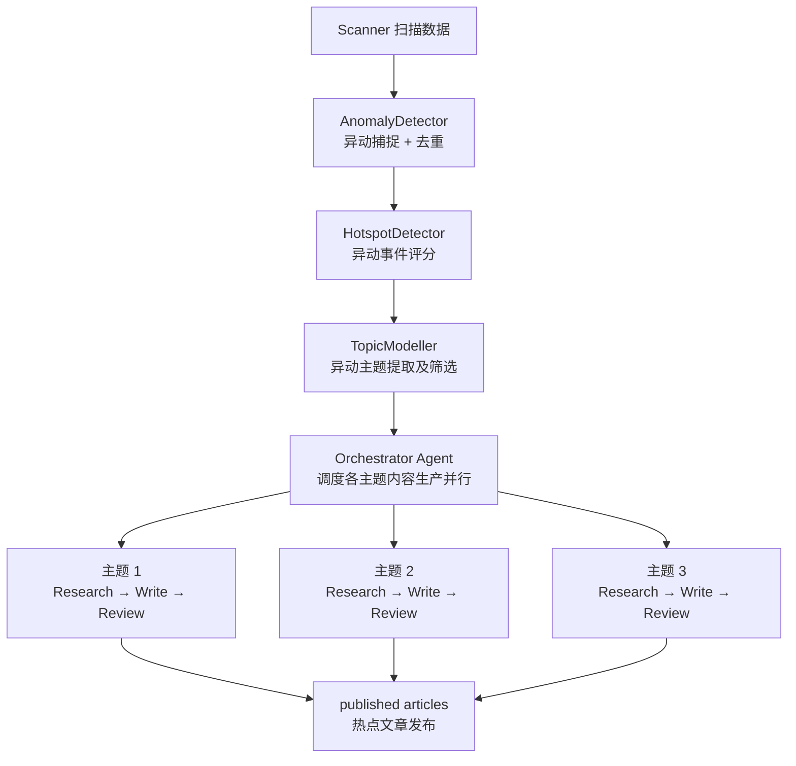
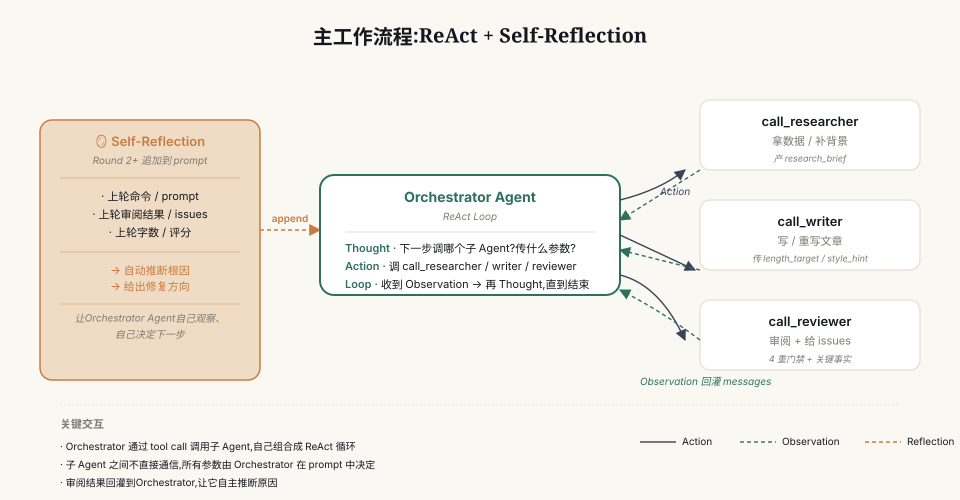
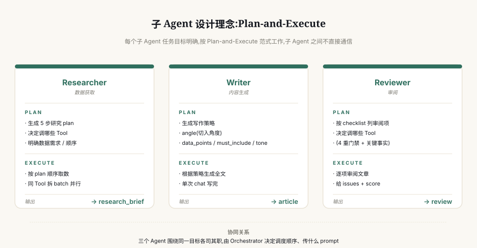

# 财经热点发现与内容生产 Multi-Agent 系统

> TL;DR: 当前的财经热点内容写作往往依赖于竞品网站已发布的内容，这也导致热点文章的创作和发布在时间上存在滞后性，内容上存在跟随性等问题。
> 本方案提出一个财经热点发现与内容生产 Multi-Agent 系统，利用算法自动识别市场异动。
> 通过将内容创作的触发点前移至金融市场信号，本方案致力于解决财经热点发现的滞后性问题。
> 另一方面，本方案把内容生产环节Agent化，用一个Orchestrator Agent总体调控内容生产步骤，指挥三个独立的Agent分别独立完成调研、写作、审阅等任务。
> 本方案中不同层级的Agent采用不同的设计范式，通过互相协作完成数据调研-文本写作-审阅修改的闭环，从而提高生成的热点内容的质量。
---

## 目录

- [Section 1 目标](#section-1-目标)
- [Section 2 方案设计](#section-2-方案设计)
  - [Section 2.1 热点挖掘与异动检测](#section-21-热点挖掘与异动检测)
    - [Section 2.1.1 热点建模：6 维特征向量](#section-211-热点建模6-维特征向量)
    - [2.1.2 4类异动检测](#212-4类异动检测)
  - [Section 2.2 Agent化热点内容生产](#section-22-agent化热点内容生产)
    - [Section 2.2.1 指挥Agent（Orchestrator）](#section-221-指挥agentorchestrator)
    - [Section 2.2.2 子 Agent（Researcher/Writer/Reviewer）](#section-222-子-agentresearcherwriterreviewer)
  - [Section 2.3 记忆管理](#section-23-记忆管理)
  - [Section 2.4 Harness和Loop Engineering](#section-24-harness和loop-engineering)
- [Section 3 工程设计](#section-3-工程设计)
- [Section 4 评估体系](#section-4-评估体系)
  - [Section 4.1 评估指标（三层）](#section-41-评估指标三层)
  - [Section 4.2 内容质量评估方法](#section-42-内容质量评估方法)
  - [Section 4.3 实际跑批示例（2026-08-06）](#section-43-实际跑批示例2026-08-06)
- [Section 5 后续优化方向](#section-5-后续优化方向)
- [项目结构](#项目结构)
- [安装与运行](#安装与运行)
- [运行模式](#运行模式)
- [关键参数](docs/关键参数.md)
- [输出产物](#输出产物)
- [Examples](examples/README.md)
- [工具与子 Agent](#工具与子-agent)
- [声明](#声明)

---

## Section 1 目标
为了提高热点挖掘效率，提前触发内容生产，本方案将目标重构为以下两个分目标：

1. 把热点内容生产的触发信号由"被动跟随竞品标题"升级为**多源信号实时驱动 + 量化热点建模**；
2. **多 Agent 协同 + 持续反馈迭代**构建内容生产闭环，提升生成质量。

---

## Section 2 方案设计
根据目标，本方案的核心设计根据目的主要可以分为两部分：
1. 潜在热点自动挖掘
2. Agent化内容生产

传统热点发掘依赖于人工识别数据和参考竞品网站文章发布情况，在热点发掘的速度和时效性上存在劣势。本方案中，我们将热点识别的的触发条件从竞品网站文章标题前移至金融市场的实时数据，通过机器学习算法自动化市场异常动向识别，在提高热点发掘速度的同时解决了内容生产触发点滞后的问题。

具体来说，本方案利用股票市场数据接口扫描实时金融数据并进行异常动向分析。被算法捕捉到的异动将计算确信度分数并进行排序，确信度最高的几项市场异动将被包装为话题，触发基于多Agent协作的内容生产环节。指挥Agent（Orchestrator）在接收到主题后，将会指挥不同职责的子Agent完成对应的调研、写作及审阅等任务：

- 调研Agent（Researcher）：自主判断并利用一系列工具收集异动相关信息，如行业背景、个股数据、政策法规等，整合成简报备用；
- 写作Agent（Writer）：接收指挥的prompt以及利用对应的简报，生成相应的文章待审；
- 审阅Agent（Reviewer）：利用相关工具审核生成文章的质量，提供审阅意见给指挥；

在完成调研-写作-审阅的流程后，指挥会根据审阅意见，自主判断是否需要再次调研获取更多数据，或是直接利用现有数据重写文章再次审阅。三个子Agent分工明确，互相之间无直接交流，由指挥统一协调从而避免了混乱的工作流程。

本方案提出的热点挖掘及内容生产流程如下图所示，后续章节将对每个组件做更具体的介绍。


***由于数据来源及计算资源有限，本方案下用于挖掘潜在热点的算法以及用于内容生产的Agent（包括对应的Tool，Skill以及Memory等模块）仅起到示例作用。实际工业生产中，可以使用更准确的算法替换以下提到的特征提取/异动捕捉等算法，以及用能力更强的LLM/Agent替换本方案中使用的LLM和Agent，从而达到更优的表现。***

### Section 2.1 热点挖掘与异动检测
本方案认为，由于热点挖掘与异动检测实时性的要求，系统应以较高频率获取市场数据进行分析。因此本方案假定有一个常驻线上的数据收集进程，每隔时间$T$，本系统将会分析本段时间内的市场数据并与历史进行对比，从而捕捉市场的异常动态。

出于验证最小可行系统的考量，本方案将此思路简化为对热点情况的6个不同维度打分后进行线性加权，以下是该部分的简单介绍。


#### Section 2.1.1 热点建模：6 维特征向量

$$\mathbf{H} = (I, P, V, N, R, D)$$

<div align="center">

| 维度 | 含义 | 数据源 |
|------|------|--------|
| $I$ Intensity | 强度 | 异动类型 + 数量 |
| $P$ Persistence | 持续性 | 时间序列稳定性 |
| $V$ Virality | 传播性 | 跨异常类型 |
| $N$ Novelty | 新颖度 | 历史案例相似度 |
| $R$ Relevance | 主体关联性 | 行业知识图谱 |
| $D$ Value Density | 价值密度 | 信息含量 |

</div>

每个维度的分数都在$[0,1]$，最终的**异动确信度分数**为：

$$\text{Score}(H) = w^T \mathbf{H}, \quad w = (0.22, 0.11, 0.11, 0.17, 0.17, 0.22)$$

$w$是每个维度的权重，在实际生产中可以学习或根据经验手动调整。出于简单性考虑，本方案中我们将权重设置为常数。
每个维度的详细公式见 [`docs/hotspot_modeling.md`](docs/hotspot_modeling.md)（6 维公式 + 实际算例 + 确信度划分）

#### 2.1.2 4类异动检测

由于金融背景及数据有限，本方案在AI辅助下设计了以下4类异动信号进行检测。实际生产中可以对更多异动类型进行总结和建模以适配不同类型的金融市场。

- `board_resonance` —— 同板块多只个股涨停（去重后 ≥ 3 只不同个股）
- `board_change_with_fundflow` —— 板块异动 + 主力净流入
- `change_with_limitup` —— 板块异动频繁（≥ 5 次）+ 多只涨停（≥ 2 只）
- `risk_concentration` —— 同板块多只跌停（风险信号）

### Section 2.2 Agent化热点内容生产
本方案重点聚焦于用多Agent协作的方式，自动化热点新闻的内容生产。参考人类撰写研究报告的方式，本方案用一个指挥Agent协调三个子Agent进行分工合作。指挥Agent与具体完成工作的Agent根据任务类型的不同，应用了不同的设计范式。以下章节将对每个Agent做具体介绍。

#### Section 2.2.1 指挥Agent（Orchestrator）



指挥Agent采用ReAct + Self-Reflection范式，具体来说：
- ReAct：每一轮循环中，指挥Agent将会自主决定应该调用哪些子Agent进行调研/写作/修改，并给出对应的prompt，直到其认为满足发布要求；
- Self-Reflection：从第二轮循环开始时，指挥Agent将会根据"上轮命令 + 上轮审阅结果"，自主推断原因放到自己的prompt 里，让指挥自己观察、决定下一步。

此设计的优势在于：
1. 相比于使用固定的调研-写作-审阅管线，让指挥Agent根据情况自主决定下一轮需要调用哪些Agent进行组合并完成文章修改，提供流程上的灵活性；
2. 子Agent作为Tool注册开放给指挥Agent调用，形式上支持接入更多的Agent分工合作完成其他额外任务（如作图等），为未来的工作流的拓展保留了更新的余地；
3. 部分情况下，子Agent可能无法完成任务（如因网络波动无法获取数据、子Agent进程意外被终止等），指挥Agent可以为异常情况兜底，自主决定是否应该重新调用失败的Agent或修改该Agent的prompt；
4. 针对具体的内容生成场景，指挥Agent可能可以在用户指导下探索出该场景下更高效的工作流程并总结为Skill以备下次复用。

#### Section 2.2.2 子 Agent（Researcher/Writer/Reviewer）



每个子 Agent（Researcher / Writer / Reviewer）的任务目标较为明确，因此本方案要求每个子Agent按照**Plan-and-Execute**范式进行工作。也即，每个子Agent会先显式地规划自己的任务再执行：

- **Researcher**：根据指挥传入的异动主题，生成研究计划，决定需要获取哪些数据以及调用哪些Tool → 按 plan 顺序执行获取数据，生成简报备用
- **Writer**：根据指挥传入的简报，生成写作策略（angle/data_points/must_include/tone）→ 根据写作策略生成全文
- **Reviewer**：根据checklist决定需要调用哪些Tool进行审阅 → 逐项审阅文章 → 总结审阅意见

子 Agent 之间**不直接通信**，完全由 Orchestrator 决定调用顺序、传什么 prompt，避免多Agent之间循环调用无法结束流程。

### Section 2.3 记忆管理

记忆管理是实现跨对话历史的信息传递方式，有效的记忆管理系统能够帮助Agent高效地完成任务，复用成功经验，避免重复犯相同的错误。
本方案按职责把记忆拆成三层。不同 Agent 按照各自需求调用，保证信息流通的同时避免历史案例污染子 Agent 的判断：

- **Working Memory (WM)** — 存当前事件上下文，默认注入所有 Agent；
- **Episodic Memory (EM)** — 存历史案例，**Orchestrator**可以调用来参考历史调度策略；
- **Semantic Memory (SM)** — 存行业知识 + 读者画像，全员共享，作为研究 / 写作 / 审阅的公共词典

每个Agent只看到自己该关心的部分。子 Agent (Researcher / Writer / Reviewer) 不接触历史案例，避免被旧案例带偏，Orchestrator 用 EM 决定调度策略。

### Section 2.4 Harness和Loop Engineering

本方案设计中，**Harness**主要体现在如下要素:

- **上下文构建器 (Context Builder)** — `tools/llm_client.py` 的 `chat_with_tools()` 每次手动组装 system prompt + user prompt + 历史消息，Writer / Reviewer 在 plan 阶段先生成上下文再执行；
- **工具注册表与边界 (Tool Registry & Boundaries)** — `tools/agent_tools.py` 统一注册工具，每个Agent只能调对应白名单内的工具；
- **持久化记忆与状态 (Persistent Memory & State)** — 三层 Memory (WM / EM / SM) + brief JSON 缓存，跨会话保留项目知识与任务进度；
- **护栏与策略 (Guardrails & Policies)** — Reviewer根据checklist审阅文章生成内容 + 指挥Agent设定循环上限 + 发布失败文章本地缓存兜底；
- **反馈与验证循环 (Feedback Loops)** — ReAct 自主循环 + Self-Reflection 让 LLM 自主推断循环未结束原因；
- **可观测性与日志 (Tracing & Audit Logs)** — 保留完整运行日志记录 CoT / tool call / result，让Agent的决策路径可复线，简化调试过程。

另一方面，**Loop Engineering（循环工程）** 主要体现在以下要素:

- **自动化 (Automations)** — 扫描完数据后，自主发现内容生产过程中的问题并启动循环，无需人工频繁介入；
- **工作树 (Worktrees)** — 并行任务中间产物按时间戳 + 主题进行规范命名，线程上下文隔离避免文件冲突；
- **技能 (Skills)** — Writer 的"写作策略"(angle / data_points / must_include / tone) 是可复用技能，规范文章生成内容和风格；
- **插件与连接器 (Plugins & Connecters)** — 利用数据工具连接真实金融市场环境，补充必需的产品/行业/板块背景，为内容生产提供真实知识；
- **子代理 (Sub-agents)** — Researcher / Writer / Reviewer 三个子 Agent 职责分离，由独立模型对产出进行校验。

## Section 3 工程设计

虽然本方案目标是验证一个自动热点挖掘及内容生成系统的可行性，我们依然在Coding Agent的辅助下进行了一些工程上的设计以提高系统效率：

1. **并行处理多个异动**：每个异动单独唤起一个线程进行内容生产，避免热点之间串行等待。本地测试中， 5 个候选从串行 ~500s 压到并行 ~350s。

2. **浅封装，无 LangChain/LangGraph**：直接用 DeepSeek SDK 调 LLM，用Coding Agent辅助实现 ReAct 的 chat_with_tools 循环。CoT / messages / tool call 全部可在log日志中观测和调试，简化调试过程。

3. **Researcher 工具并行**：多个获取数据的 Tool 的调用拆成 batch，用 ThreadPoolExecutor 并发跑；不同 Tool 之间也互不干扰，进一步压短数据获取时间。

---

## Section 4 评估体系

### Section 4.1 评估指标（三层）
由于缺少具体可以对比的竞品及数据集，本方案仅提出部分可用于评估系统表现的指标，实际生产环境中应当根据实际要求调整评估方案：

1. **热点发现质量**：信号数、候选数、平均评分、确信度分布
2. **内容质量**：草稿数、审核通过数、审核通过率、平均审核分、用户满意度
3. **业务指标**：发布数、发布率、字数合规率、关键事实覆盖数、发布领先竞品时间

### Section 4.2 内容质量评估方法

- **自动评估**：每次跑完生成 `output/reports/eval_YYYYMMDD_HHMMSS.md`
- **健康度等级**：🟢 健康（通过率 ≥ 80%）/ 🟡 一般 / 🔴 异常
- **失败追踪**：未通过的文章记到 failed_articles，用于复盘

### Section 4.3 实际跑批示例（2026-08-06）

最近一轮跑批（[round_20260806_181528](examples/round_20260806_181528/)）的真实数据：

| 指标 | 数值 |
|------|------|
| 信号 / 异动 / 候选 | 342 / 15 / 15 |
| 高 / 中 / 低确信度候选 | 1 / 14 / 0 |
| 草稿 / 审核通过 / 发布 | 7 / 5 / 5 |
| 平均字数 / 平均审核分 | 1828 字 / 98.6 |
| 整体健康度 | 🟢 健康（5 / 5 发布成功） |

5 个发布主题：消费电子、半导体、通信设备、计算机设、元件（按 6 维评分排序）。

---

## Section 5 后续优化方向

- [ ] 加入更多用于获取真实市场数据的工具
- [ ] 接入社交媒体（雪球/微博/小红书等），收集投资者情绪和舆情
- [ ] 升级异动捕捉和热点检测算法
- [ ] 增加可视化人工审核界面
- [ ] A/B 测试框架（不同 prompt / 不同模型对比）
- [ ] 流式输出（每篇文章生成完通过审核立即推送，不等全部跑完）
- [ ] 更多稳健的错误兜底机制，防止Agent调用工具失败时陷入死循环
- [ ] 更严格的审阅机制，目前审阅机制过于简单，文章审阅分数往往偏高

---

## 项目结构

```
finance_hotspot_agent/
├── main.py                      # 入口
├── config.py                    # 全局配置
├── requirements.txt             # 依赖
├── README.md
├── .gitignore
│
├── agents/                      # 8 个核心 Agent
│   ├── base.py                  # BaseAgent 基类
│   ├── scanner.py               # 3 天信号扫描
│   ├── anomaly_detector.py      # 异动检测
│   ├── hotspot_detector.py      # 6 维热点识别
│   ├── topic_modeler.py         # 话题建模
│   ├── researcher.py            # 研究 Agent
│   ├── writer.py                # 写作 Agent
│   ├── reviewer.py              # 审阅 Agent
│   └── orchestrator.py          # 指挥 Agent
│
├── tools/                       # 工具层
│   ├── akshare_tools.py         # akshare 封装
│   ├── agent_tools.py           # 工具注册
│   ├── agent_subagent_tools.py  # 子 Agent 工具
│   ├── dummy_tools.py           # Dummy 工具
│   ├── llm_client.py            # LLM 客户端
│   ├── persist.py               # 持久化
│   ├── disable_proxy.py         # 代理禁用
│   └── data_explorer.py         # 数据探索
│
├── memory/                      # 三层记忆
│   ├── working_memory.py        # 当前事件上下文
│   ├── episodic_memory.py       # 历史案例
│   └── semantic_memory.py       # 行业知识
│
├── evaluation/
│   └── evaluator.py             # 评估报告
│
├── assets/                      # 图片资源
│   ├── orchestrator_main_flow.svg   # 主工作流程图
│   └── sub_agents_design.svg        # 子 Agent 设计图
│
├── docs/                        # 文档
│   ├── hotspot_modeling.md      # 6 维建模公式
│   └── 关键参数.md               # 关键参数
│
├── tests/
│   ├── test_basic.py            # 基础测试
│   ├── test_llm.py              # LLM 测试
│   ├── test_researcher_tools.py # Researcher 测试
│   └── test_tools.py            # 通用测试
│
├── examples/                    # 示例跑批快照
│   ├── README.md                # 总览
│   └── round_<时间戳>/          # 单轮产物
│
└── output/                      # 运行时产物
    ├── articles/                # 文章
    ├── briefs/                  # 研究简报
    ├── anomalies/               # 异动检测结果
    ├── candidates/              # 热点候选
    ├── react_traces/            # ReAct 轨迹
    ├── reports/                 # 评估报告
    ├── logs/                    # 运行日志
    └── cache/                   # akshare 缓存
```

---

## 安装与运行

### 1. 准备环境

```bash
# 推荐 conda 装 Python 3.10+
conda create -n finance_agent python=3.11 -y
conda activate finance_agent

# 装依赖
pip install -r requirements.txt
```

### 2. 配置 API Key

DeepSeek API Key 配置在环境变量中：

```bash
export DEEPSEEK_API_KEY="sk-..."
```

### 3. 调参

通过环境变量覆盖 `config.py` 里的参数：

```bash
# 只跑 2 个 candidate、2 个 worker（快）
ORCHESTRATOR_TOP_N=2 ORCHESTRATOR_MAX_WORKERS=2 \
ORCHESTRATOR_MAX_OUTER_ROUNDS=2 \
  python main.py --no-proxy
```

完整参数见 [docs/关键参数.md](docs/关键参数.md)。

---

## 运行模式

| 模式 | 命令 | 说明 |
|------|------|------|
| `full` | `python main.py --no-proxy` | 默认。扫描 → 异动 → 热点 → 话题 → 写文章 → 审核 → 评估 |
| `scan` | `python main.py --mode scan --no-proxy` | 只到热点识别，不写文章 |
| `human` | `python main.py --mode human --no-proxy` | 中确信度候选需要人工确认再继续 |
| `report` | `python main.py --mode report --no-proxy` | 不重跑，只对当前 WM 生成报告 |


---

## 输出产物

最近一轮跑批的真实产物快照见 [`examples/round_20260806_181528/`](examples/round_20260806_181528/),文章在 [articles/](examples/round_20260806_181528/articles/) 目录下(5 篇示例文章 + 完整中间产物)。

跑完一次 `full` 模式,产出在 `output/` 下:

```
output/
├── articles/
│   └── 20260804_021913_专业工程.md          # 生成的 Markdown 文章
├── briefs/
│   └── 20260804_021913_专业工程_brief_1785781153_3314.json
│                                          # 研究简报(plan/tool_data/key_facts)
├── anomalies/
│   └── 20260804_021855.json               # 异动检测结果
├── candidates/
│   └── 20260804_021855.json               # 热点候选
├── react_traces/
│   └── 20260804_021913.json               # ReAct 决策轨迹(每个 candidate 一份)
├── reports/
│   └── eval_20260804_022114.md            # 评估报告
├── logs/
│   └── run_20260804_021855.log            # 完整运行日志
└── cache/                                  # akshare 文件缓存
```

---

## 工具

### Researcher 工具（6 个，plan prompt 白名单）

| 工具 | 作用 | 关键参数 |
|------|------|---------|
| `get_limit_up_pool` | 涨停股池 | `{}` |
| `get_board_change` | 板块异动 | `{}` |
| `get_global_news` | 全球财经快讯 | `{}` |
| `get_news` | 个股新闻 | `{"symbol": "6位股票代码"}` |
| `get_yjyg` | 业绩预告 | `{"date": "20250331"}` |
| `get_financial_report` | 三大报表 | `{"symbol": "6位股票代码", "report_type": "..."}` |


### Orchestrator 工具（3 个子 Agent）

| 工具 | 作用 | 关键参数 |
|------|------|---------|
| `call_researcher` | 调 Researcher 做研究 | `topic_subject, topic_industry, focus_areas, extra_symbols` |
| `call_writer` | 调 Writer 写文章 | `research_brief_json, style_hint, length_target` |
| `call_reviewer` | 调 Reviewer 审核 | `article_json, focus_areas` |


### Dummy 工具（3 个 [DUMMY] + 1 个真实）

| 工具 | 状态 | 说明 |
|------|------|------|
| `dummy_web_search` | DUMMY | 模拟网络搜索 |
| `dummy_social_sentiment` | DUMMY | 模拟社交媒体舆情 |
| `dummy_macro_indicator` | DUMMY | 模拟宏观经济指标 |
| `check_article_length` | 真实 | Reviewer 内部用的字数检查 |

---

## 声明

- **代码**: 本项目代码由 [Minimax Code](https://github.com/MiniMax-AI/MiniMax-Code) 辅助完成
- **LLM**: 本项目Agent均使用 [DeepSeek-V4-Flash-0731](https://platform.deepseek.com/) 作为LLM

